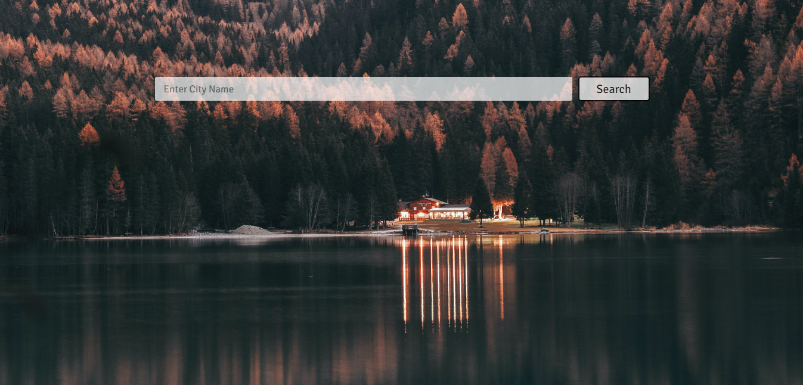
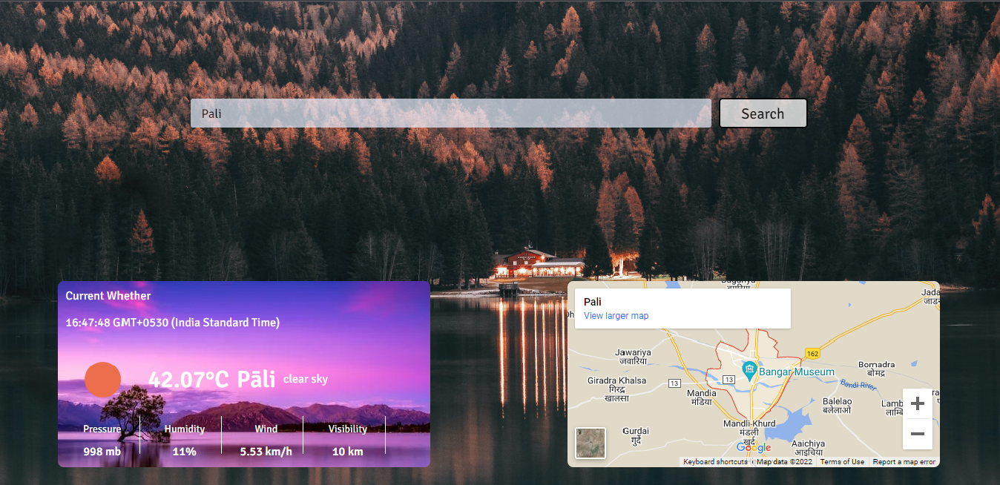
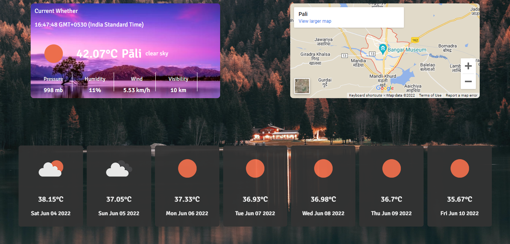

# Weather app

Weather app is a web application for weather forcast hence the name. Here you can search for the location and 
it will give you the necessary info of the weather with a map of the location and the next 7 day's weather forcast.
In this project I tried to build erverything with some coolness and I am happy with it. I think I 
learned alot from it. In the future I like to try more different things in my project and explore more.

here is the link to checkout the site - [click here](https://wondrous-tapioca-53481a.netlify.app/).

## Tech Stack
- Javascript
- HTML 
- CSS
- Open weather api

## Features

- You can search for the location it will give result based on it
- Map of the location is shown
- General info of that place is shown (ex. temp)
- The next upcoming 7 days forcast is shown

## Screenshots

## Conclusions
- I had so much fun building this website that I want to build some more. Even though I had to scrifice some of my free time to build it
  and during that time I had so many difficulties but i am so happy with it and I am so glad that I stuck through it and made to the end.

